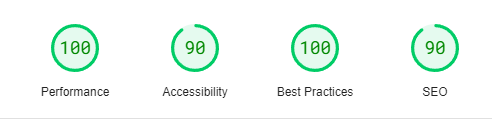

  

  <h2 align="center">Sunnyside Agency Landing Page Solution</h2>
  

     
    <a href="https://jackzz119.github.io/sunnyside-agency-landing-page/">View Demo</a>
    &nbsp;·&nbsp;
    <a href="https://github.com/jackzz119/sunnyside-agency-landing-page/issues">Report Bug</a>
    &nbsp;·&nbsp;
    <a href="https://github.com/jackzz119/sunnyside-agency-landing-page/issues">Request Feature</a>
  

   &nbsp;&nbsp;&nbsp;

   &nbsp;&nbsp;&nbsp;

  <!-- Difficulty -->
  

 
 

## **Preview**

 

## **Links**

- |||
  | :----- | :----- |
  | Solution URL: | [To be posted :hourglass_flowing_sand:](#link) |
  | Live Site URL: | [https://jackzz119.github.io/sunnyside-agency-landing-page/](https://jackzz119.github.io/sunnyside-agency-landing-page/) |
  |||

 

## Pagespeed Insights Score:
  
- ||
  | :-----: |
  |  <b>Overall score 98.2% for Both Mobile & Desktop</b> (Below score is for mobile devices) |
  | |
  |  |
  | |
  | Check out [**Pagespeed Insights**](https://pagespeed.web.dev/analysis/https-jackzz119-github-io-sunnyside-agency-landing-page/oo0rooqvs3?form_factor=desktop) to get live score |
  ||

 

## The Challenge

- The challenge is to build out this Sunnyside Agency Landing Page and get it looking as close to the design as possible.
- Users should be able to:
    - View the optimal layout for the site depending on their device's screen size
    - Usage of Hamburger menu for mobile devices to display navigational links
    - See hover states for all interactive elements on the page

 

## **Built With**

  &nbsp;  &nbsp; 

 

## **Tools Used**

 &nbsp;   &nbsp;  &nbsp; 

 

 

## **Let's Connect 👋**

  &nbsp;&nbsp;&nbsp;

  <!--  &nbsp;&nbsp;&nbsp; -->

  

 